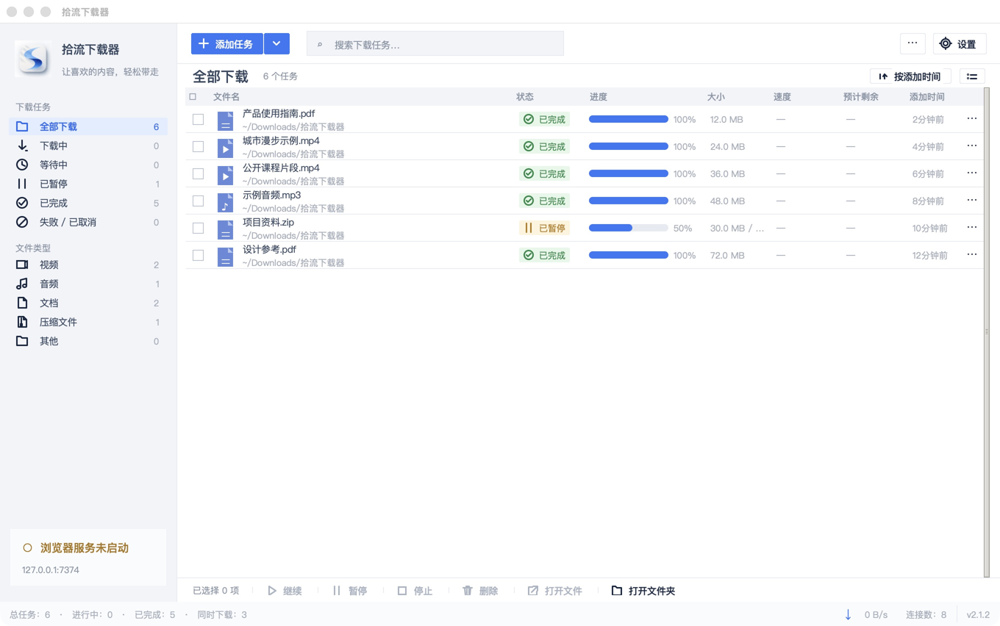

<div align="center">

**[简体中文](README.md) | English**

# 拾流下载器 · Shiliu Downloader

### A local download tool for macOS

File downloads · Web video detection · Browser integration · Local task management


</div>

## Introduction

Shiliu Downloader connects finding content on the web, creating a task, downloading and managing files in a clear local workflow. Local first, a simple interface, and coordination between Chrome and the desktop app are its core principles.

This is **public source**, not a claim of OSI open-source licensing. No root project LICENSE has been selected. Third-party licenses apply to their respective components. No officially signed and notarized V2.1.2 installer is currently available.

## Navigation

[Screen](#main-window) · [Features](#features) · [Quick start](#quick-start) · [Installation](#macos-installation) · [Source](#running-from-source) · [Extension](#browser-extension) · [Privacy](#data-and-privacy) · [FAQ](#faq) · [Changelog](#changelog)

## Main window



Actual V2.1.2 running window with six generic demo tasks in an isolated temporary data directory. No personal paths, history or real URLs. The browser service was disabled for this demo; displayed task states illustrate the interface.

## Positioning

A macOS tool for local file downloads, web video detection and desktop task management. Site support depends on access rights, network conditions and upstream extractors. Support for every site is not promised.

## Features

- HTTP/HTTPS files, multiple connections, pause/resume, stop and delete.
- Task categories, search, progress, speed, open files and folders.
- Chrome video detection and download requests; optional download interception.
- HLS/DASH segments and merging, plus selected sites through yt-dlp.
- FFmpeg/FFprobe media tools and Node.js extraction support.
- Optional WeChat Channels integration uses a separate third-party tool and requires explicit local setup.

## Quick start

1. Set up Python and start the desktop app from source as below.
2. Load the repository's `browser_extension` folder in Chrome.
3. Keep the desktop app running on `127.0.0.1:7374`, then download content you are authorized to access.

[Releases](https://github.com/gokumaomao-sketch/shiliu-downloader/releases) does not currently offer a public V2.1.2 DMG. Local test packages are not Developer ID signed or notarized.

## macOS installation

Target: macOS 26.0+, Apple Silicon arm64. The current build was tested on macOS 26.5.2; The bundled Python.framework has an actual minimum OS of 26.0; older macOS compatibility is not claimed. Intel packages are not validated. V2.1.2 binary release remains Draft.

There is no officially released installer yet. This README does not instruct users to disable Gatekeeper or bypass macOS warnings. Developers may run source or follow [build instructions](docs/构建说明.md).

Once a signed public package exists, verify SHA256. ZIP extraction yields an App; a DMG provides an Applications drag-and-drop entry. The Chrome extension must be loaded separately.

## Running from source

Use a Python installation with Tk (Python 3.14 was tested):

```bash
python3.14 -m venv .venv
source .venv/bin/activate
python -m pip install -r requirements.txt
python main.py
```

FFmpeg/FFprobe and Node.js are external tools, not committed binaries. Install them on PATH for source use, or prepare build resources as documented. Obtain the Channels tool from upstream and follow MIT + Commons Clause.

```bash
python -m pip install -r requirements-dev.txt
NO_PROXY='*' no_proxy='*' python scripts/run_tests_isolated.py
node tests/test_page_player.js
```

The full suite includes display-dependent tests and known stale assertions. See [verification notes](docs/验证说明.md); no build-passing badge is claimed.

## Browser extension

1. Start the desktop app and its browser service.
2. Open Chrome's extensions manager, enable Developer mode and choose **Load unpacked**.
3. Select the folder containing `manifest.json`: `browser_extension` in source, or `拾流下载器.app/Contents/Resources/browser_extension` in a built app. Settings → Browser shows the resolved location.
4. Refresh the target page, then use an injected download button, extension popup or context menu.

If an optional connection token is configured, both sides must match. Never share that token in Issues. The extension version is 2.1.2. Reload the extension and refresh pages after updates. Keep its loaded directory in a stable location.

## Basic use

Add a direct URL, check its filename and destination, then create a task. For web videos, keep the desktop app running and use Chrome's extension controls. Select tasks to resume, pause, stop, delete or open files/folders. Use the sidebar and search to find tasks.

For failures, check network access, expired URLs, permissions and external tools. The app does not bypass DRM.

## Data and privacy

- Default data: `~/Library/Application Support/拾流下载器`; default downloads: `~/Downloads/拾流下载器`. Custom locations are preserved.
- Local history may contain URLs, referrers, filenames and custom headers. Redact it before sharing.
- Extension requests go to the local 7374 service. Downloads, site extraction and dependency acquisition contact their respective websites; this is not a fully offline application.
- Cookie permission is optional and off by default. When enabled, cookies can be used for local requests. The task model does not persist its `cookie` field, but other history fields may still be sensitive.
- No user data, cookies, tokens, logs or signing credentials are committed. Legacy-directory detection only supports one-time upgrade migration; normal operation uses the new directory.
- Channels may involve a local proxy/certificate. Configure it only intentionally and understand the third-party tool.

## Support the project (optional appreciation)

<div align="center">

</div>

Reuses the existing [WeChat appreciation code](https://github.com/gokumaomao-sketch/AI-Video-Research-Pipeline/blob/main/docs/support/wechat-appreciation.png) already published with the multimodal project. This is **not a discussion group or support channel**. Payment is not required for source access or future free downloads; appreciation does not purchase software, features, services or a license.

## GitHub Issues

Use [Issues](https://github.com/gokumaomao-sketch/shiliu-downloader/issues) with version, macOS/architecture, reproduction steps and redacted error details. Do not upload cookies, tokens, private URLs, full databases or raw user logs.

## FAQ

**Where is the V2.1.2 DMG?** No public binary release yet: Developer ID Application and notarization conditions are missing.

**Why is the extension disconnected?** Check the app, local 7374 service and optional token. Reload the extension and refresh pages after updating.

**Does every video site work?** No guarantee. Access restrictions, login, expiring URLs, DRM and upstream changes may prevent downloading.

**Where are files and history?** See Data and privacy; configured custom locations take precedence.

**Is the project MIT licensed?** No root project LICENSE is selected. Third-party notices do not license the whole project.

**Does it support Intel Macs?** Current local packages target arm64; Intel has not been validated.

## Project structure

```text
magic_downloader/       Desktop and download modules
browser_extension/     Chrome resources
assets/readme/         Product screenshot and reused QR
manifests/             Extension manifest templates
tests/                 Python and JavaScript tests
scripts/               Reproducible build scripts
docs/                  Build, verification and release notes
third_party_licenses/  Upstream licenses and notices
拾流下载器-macos.spec   PyInstaller bundle definition
```

No runtime data, downloaded files or third-party executables are stored in the source repository.

## Third-party components

| Component | Purpose / licensing |
| --- | --- |
| Python / Tk | Runtime; PSF / Tcl-Tk |
| requests / Pillow / cryptography | Networking, images, cryptography; respective upstream licenses |
| yt-dlp / yt-dlp-ejs | Site extraction; respective distribution licenses |
| Node.js 24.21.0 | Extraction support; MIT and bundled third-party notices |
| FFmpeg / FFprobe 9.0.2 | Minimal official-source build; LGPL-2.1-or-later, no external codec libraries |
| wx_channels_download v260907 | Channels tool; MIT + Commons Clause, no unlicensed Sell |

See [MAC_BINARY_PROVENANCE.md](MAC_BINARY_PROVENANCE.md) and `third_party_licenses` for sources, hashes and build flags. The original upstream MIT notice is retained; it is not a root project license. FFmpeg runs as a separate process, and local packages include corresponding source and build instructions.

## Changelog

### V2.1.2 · 2026-09-30

A publication and distribution closure release: product README, public-source audit, third-party compliance and macOS build provenance. Core download behavior remains V2.1.1.

Fresh formal-source extraction, portable paths and branding cleanup; bilingual homepage and private-data-free screenshot; reused QR; official FFmpeg source build. Local arm64 test packages remain subject to the signing and notarization release gate.

## Version and platform

**V2.1.2 · macOS · Apple Silicon arm64 · Public source**. No root license selected; no claims of Apple certification, notarization or universal site support.
